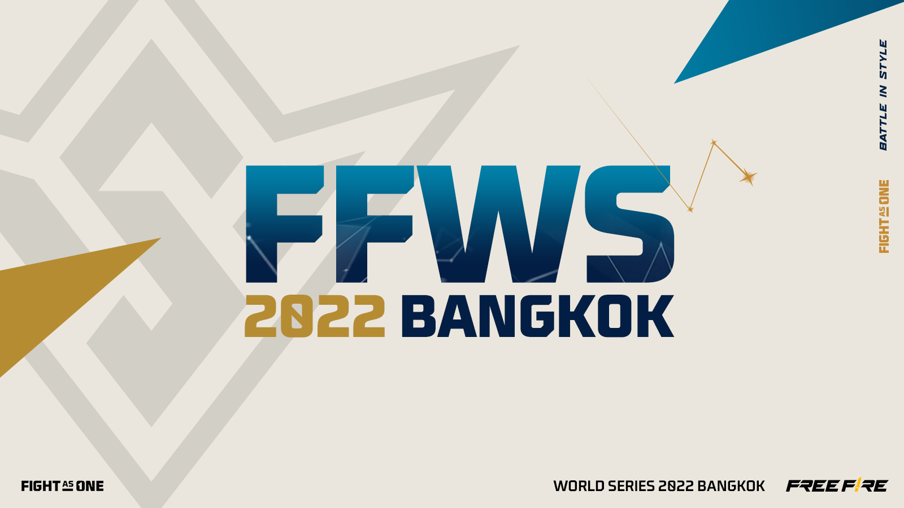
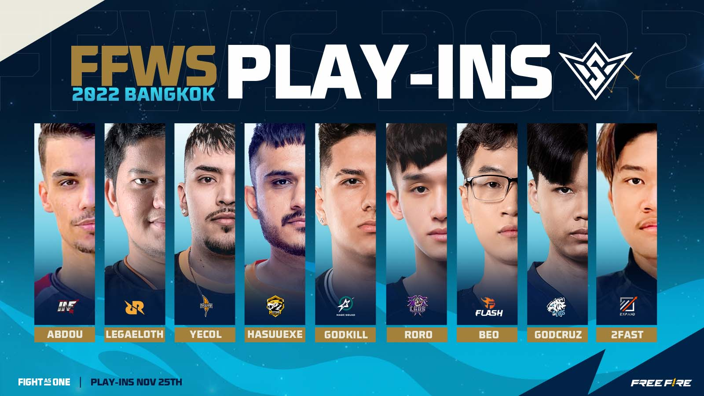
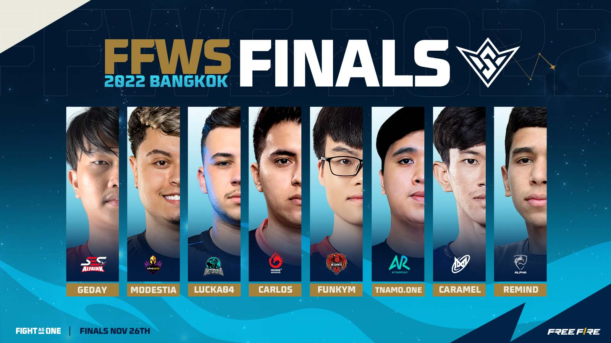
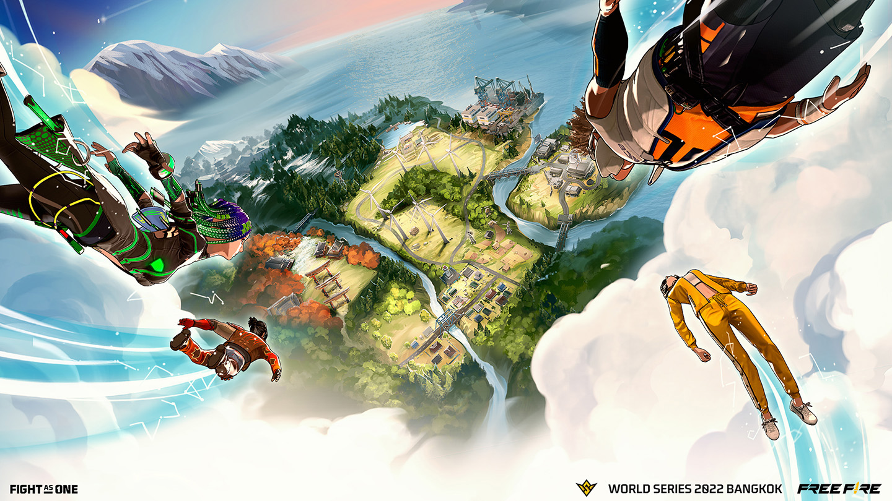
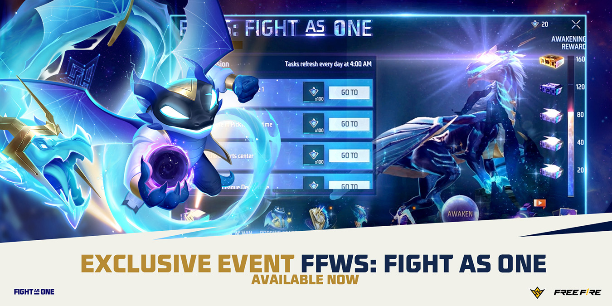
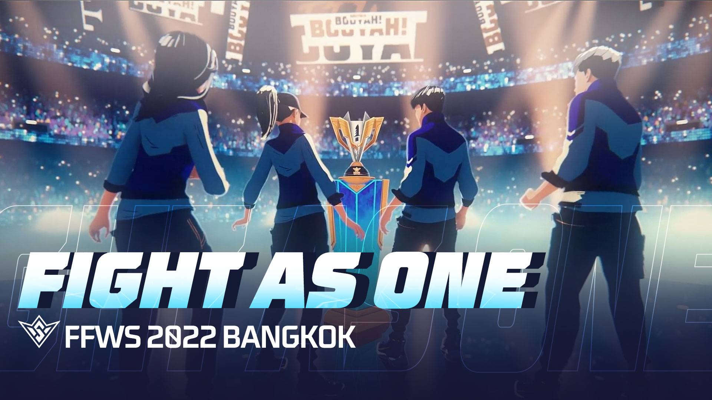

# Free Fire · 2022年FFWS Bangkok代币活动补充

- 公告日期：2022-11-24
- 官方来源：[The globe’s best teams have landed in Thailand to compete at Free Fire World Series (FFWS) 2022 Bangkok](https://ff.garena.com/en/article/939/)
- 审阅日期：2026-09-19
- 1 个分类小节；1 项说明及表格行；6 张官方公告插图。

主流程通读正文并逐项复核；公告日期与活动日期分开，所有正文图归档展示。未在原文核实的OB号不推算。

公告日2022-11-24；各项实际状态及活动期限见小节。

FFWS 2022 Bangkok赛事总览。原文：The globe’s best teams have landed in Thailand to compete at Free Fire World Series (FFWS) 2022 Bangkok。[官方原图](https://cdn.wildflamestudio.com/common/web_event/official2.ff.garena.all/202211/6282acb010e4445e5970bf13824bb4d1.jpg) · 1600×900。

入围赛队伍展示（NOV 25TH）。原文：The globe’s best teams have landed in Thailand to compete at Free Fire World Series (FFWS) 2022 Bangkok。[官方原图](https://cdn.wildflamestudio.com/common/web_event/official2.ff.garena.all/202211/9e653660cb41feb81551a0f1e2af010b.jpg) · 1600×900。

决赛队伍展示（NOV 26TH）。原文：The globe’s best teams have landed in Thailand to compete at Free Fire World Series (FFWS) 2022 Bangkok。[官方原图](https://cdn.wildflamestudio.com/common/web_event/official2.ff.garena.all/202211/a91da6a3df97014a1a1e34fc1f513854.jpg) · 1600×900。

Alpine地图赛事宣传图。原文：The globe’s best teams have landed in Thailand to compete at Free Fire World Series (FFWS) 2022 Bangkok。[官方原图](https://cdn.wildflamestudio.com/common/web_event/official2.ff.garena.all/202211/0a7732b2bd3ccafbb20104af6cf3828c.jpg) · 1440×810。

FFWS: FIGHT AS ONE活动界面与Arvon。原文：The globe’s best teams have landed in Thailand to compete at Free Fire World Series (FFWS) 2022 Bangkok。[官方原图](https://cdn.wildflamestudio.com/common/web_event/official2.ff.garena.all/202211/06c2045f9997a12d8322e9dae67437a1.jpg) · 1350×675。

Fight as One音乐视频宣传图。原文：The globe’s best teams have landed in Thailand to compete at Free Fire World Series (FFWS) 2022 Bangkok。[官方原图](https://cdn.wildflamestudio.com/common/web_event/official2.ff.garena.all/202211/c5b574839ccd7307f984ced34c44c585.jpg) · 1920×1080。

## BR · 大逃杀

### BR地图散落FFWS代币

- 归属：BR · 大逃杀 / 活动覆盖
- 原文小节：Attractive in-game rewards up for grabs this November
- 时间：公告时活动进行中，至2022-12-01；未列开始日及截止时区。

- BR地图中散落FFWS tokens，玩家可在对局中寻找收集；代币用于FFWS: FIGHT AS ONE活动界面的5个限时里程碑。原文未给地图名单、刷新点、数量或拾取上限。

## CS · 枪王对决

## 通用局内调整

## 其他玩法与局外内容（目录摘要）

### CS等模式赛后奖励

CS、Lone Wolf及其他特殊模式完成对局后可获代币；这是赛后奖励，不能当作CS地图掉落。日常任务同样提供代币。5个里程碑奖励包括背包、电竞卡牌箱，最终大奖为宠物Arvon；本文未提供宠物战斗技能。

原文目录：Attractive in-game rewards up for grabs this November

### 收集、小游戏、时长及预测活动

集齐12张代表各赛区及赛事的电竞卡，获得Melee-Sickle与随机奖励箱；Popping Stars小游戏可得皮卡奖励，游玩时长活动提供分档奖励。Pick’n Win预测队伍排名、最致命武器及冠军，所有投票参与者均有奖励，不取决于选择。

原文目录：League Deck Collection / Popping Stars / Pick’n Win

### 赛事赛制与日期疑点

17队参加赛事；开头写11月25～26日22:00（GMT+8），分入围赛和决赛，各8局，轮换Bermuda、Kalahari、Purgatory和首次进入世界赛的Alpine。每次淘汰1分，第一名12分、第二9分、第三8分，同分以BOOYAH次数决定；这是赛事规则，不改写常规BR计分。Pick’n Win段落却写入围赛11月26日开始，与前文有出入，保留日期疑点。正文回顾Attack All Around在上一届以1分击败EVOS Phoenix及本届泰国种子Nigma Galaxy/EVOS，不属于游戏更新。

原文目录：The contestants battle it out in the Play-ins and Finals stages

### 主题音乐与宣传

主题音乐视频Fight as One展示吉祥物Arvon的变身故事；不据宣传动画推断宠物技能，结尾为官方社交媒体导流。

原文目录：Fight as One / closing

## 官方图片索引

正文图片按相关小节展示，版本总览及其他章节插图另列；同一原图只嵌入一次。

- [FFWS 2022 Bangkok赛事总览](https://cdn.wildflamestudio.com/common/web_event/official2.ff.garena.all/202211/6282acb010e4445e5970bf13824bb4d1.jpg) · 1600×900 · 本地 `assets/ff-patches/939-01.jpg`
- [入围赛队伍展示（NOV 25TH）](https://cdn.wildflamestudio.com/common/web_event/official2.ff.garena.all/202211/9e653660cb41feb81551a0f1e2af010b.jpg) · 1600×900 · 本地 `assets/ff-patches/939-02.jpg`
- [决赛队伍展示（NOV 26TH）](https://cdn.wildflamestudio.com/common/web_event/official2.ff.garena.all/202211/a91da6a3df97014a1a1e34fc1f513854.jpg) · 1600×900 · 本地 `assets/ff-patches/939-03.jpg`
- [Alpine地图赛事宣传图](https://cdn.wildflamestudio.com/common/web_event/official2.ff.garena.all/202211/0a7732b2bd3ccafbb20104af6cf3828c.jpg) · 1440×810 · 本地 `assets/ff-patches/939-04.jpg`
- [FFWS: FIGHT AS ONE活动界面与Arvon](https://cdn.wildflamestudio.com/common/web_event/official2.ff.garena.all/202211/06c2045f9997a12d8322e9dae67437a1.jpg) · 1350×675 · 本地 `assets/ff-patches/939-05.jpg`
- [Fight as One音乐视频宣传图](https://cdn.wildflamestudio.com/common/web_event/official2.ff.garena.all/202211/c5b574839ccd7307f984ced34c44c585.jpg) · 1920×1080 · 本地 `assets/ff-patches/939-06.jpg`

## 原文目录（对照用）

- The globe’s best teams have landed in Thailand to compete at Free Fire World Series (FFWS) 2022 Bangkok
