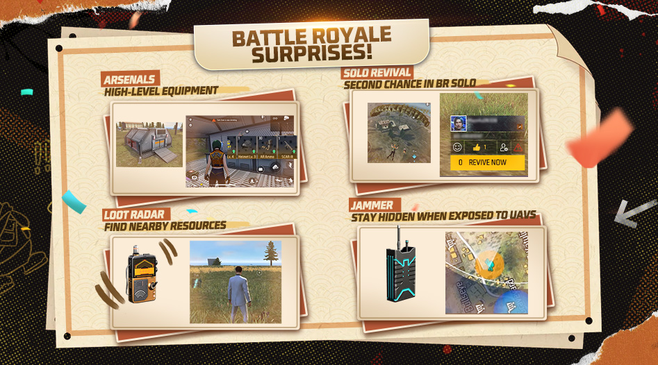
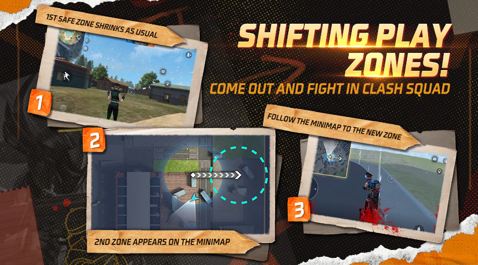
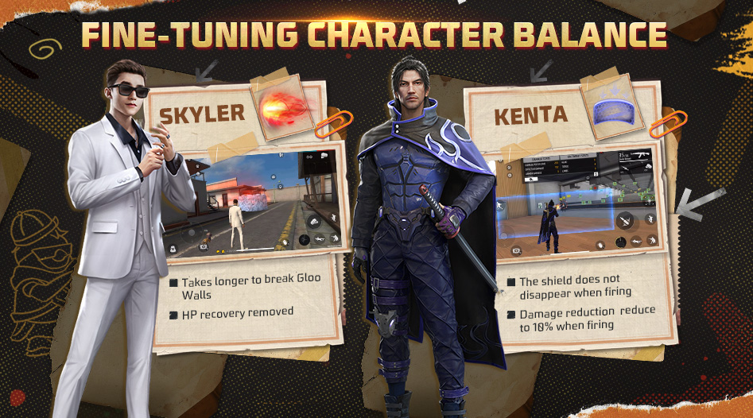
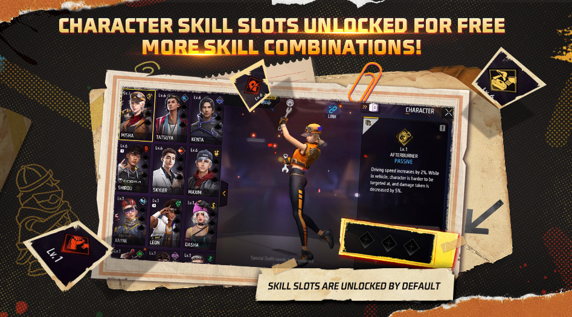
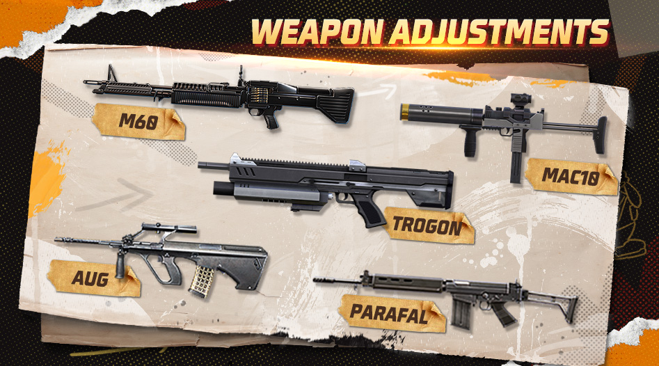
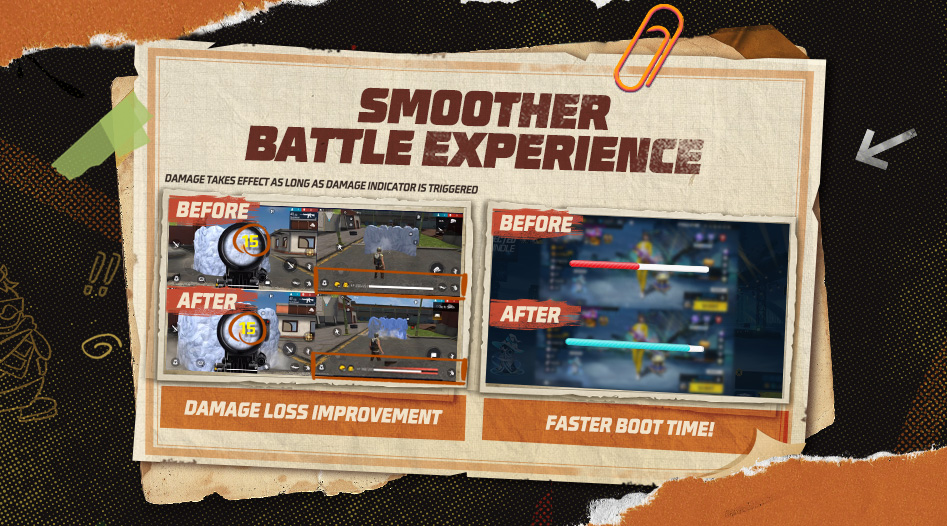
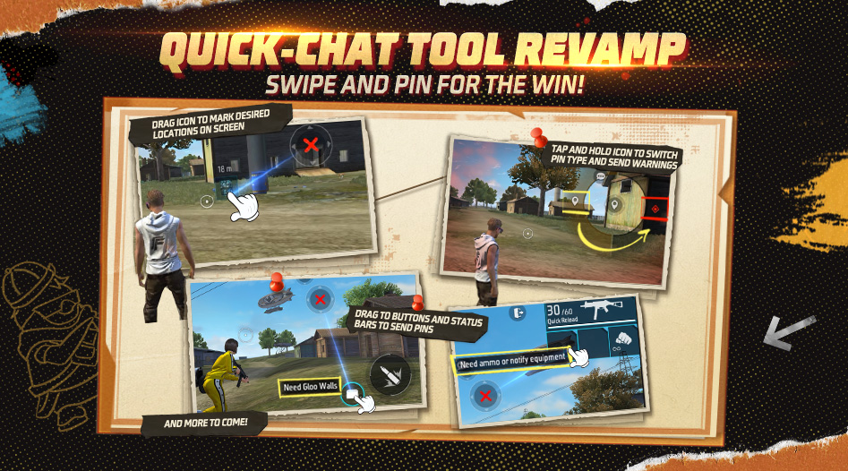
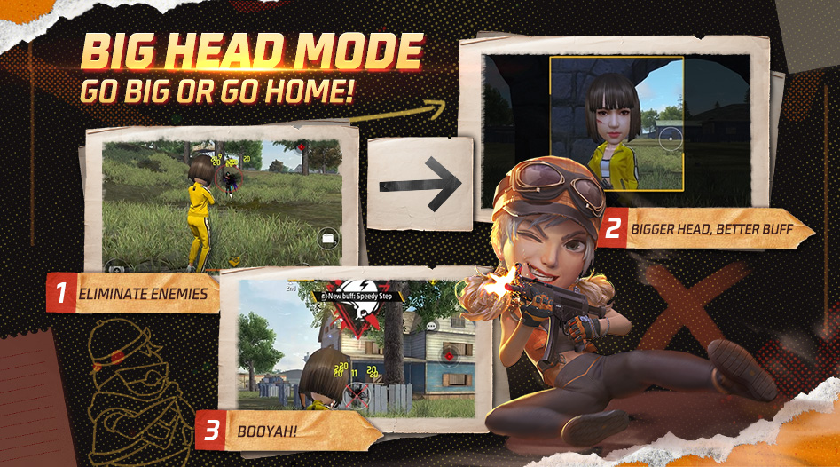
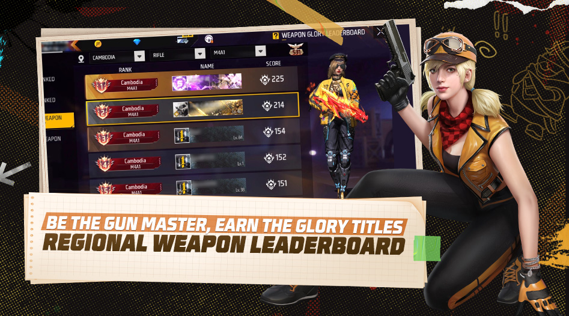

# Free Fire · OB38 · 2023 年 1 月更新

- 公告日期：2023-01-11
- 官方来源：[Patch Notes](https://ff.garena.com/en/article/968/)
- 审阅日期：2026-09-19
- 36 个分类小节；55 项说明及表格行；10 张官方公告插图。

逐项复核本篇 BR、CS 与通用局内章节；独立玩法和局外内容另列目录处置。未将公告日期当作统一上线日期。全部正文图已归档并按实际图像内容关联。

公告日：2023-01-11；同页配图将Santino与Kactus标为即将通过Booyah Pass开放，具体日期未列。

## BR · 大逃杀

### 军械库

- 归属：BR · 大逃杀 / 常规调整
- 原文小节：Battle Royale > Arsenals
- 时间：公告日：2023-01-11；本项未另列精确生效时刻。

BR军械库、单排复活、物资雷达和干扰器。原文：Battle Royale。[官方原图](https://cdn.wildflamestudio.com/common/web_event/official2.ff.garena.all/20231/b9d8386dde2c08d20d23bb203c86990e.jpg) · 947×526。

- 军械库有机会取得三级枪械和空投专属武器；每张地图有5–6个，位置显示在小地图。
- 进入军械库需要钥匙；每个主要区域有1–2把。
- 售货机钥匙600 FF币；全局所有售货机合计仅3把。空投售货机钥匙400 FF币，每台有1把。

### BR 战斗卡

- 归属：BR · 大逃杀 / 常规调整
- 原文小节：Battle Royale > BR Battle Card
- 时间：公告日：2023-01-11；本项未另列精确生效时刻。

- 离开出生岛后向队友展示战斗卡；可自定义展示战绩，并展示已装备技能。

### 载具改进

- 归属：BR · 大逃杀 / 常规调整
- 原文小节：Battle Royale > Vehicle Improvements
- 时间：公告日：2023-01-11；本项未另列精确生效时刻。

- 载具更易控制、更适合爬坡；高速驶过陡坡可短暂腾空。
- 提高载具生命值，降低“vehicle damage”；原文未明确该伤害是载具造成还是承受，保留方向歧义，不推造数值。

### 干扰器

- 归属：BR · 大逃杀 / 常规调整
- 原文小节：Battle Royale > New Item - Jammer
- 时间：公告日：2023-01-11；本项未另列精确生效时刻。

- 装备干扰器后，不会被Clu的Tracing Steps、Memory Mist、Dinoculars或UAV侦测；小地图不再暴露位置；由空投取得。

### 战利品雷达

- 归属：BR · 大逃杀 / 常规调整
- 原文小节：Battle Royale > New Item - Loot Radar
- 时间：公告日：2023-01-11；本项未另列精确生效时刻。

- 所有BR玩家开局默认装备物资雷达；每25秒显示75米内未拥有、等级更高的物资，通过标记提醒。未明确判断等级的具体基准。
- 可在背包中手动关闭雷达。

### 单排复活

- 归属：BR · 大逃杀 / 常规调整
- 原文小节：Battle Royale > Solo-Queue Revival
- 时间：公告日：2023-01-11；本项未另列精确生效时刻。

- BR单排休闲和排位每局仅有1次复活机会，仅在前3分钟有效。
- 右上角心形指示：灰色为未激活，黄色为激活，红色为激活且30秒后关闭。

### BR售货机、复活点与防御空投

- 归属：BR · 大逃杀 / 常规调整
- 原文小节：Battle Royale > Solo-Queue Revival
- 时间：公告日：2023-01-11；本项未另列精确生效时刻。

来源为Solo-Queue Revival之后的粗体Other BR adjustments列表，逐项适用范围按正文，不将整组归为单排。

- 售货机武器改为M1014-1、AN94、M4A1-1、Woodpecker，价格300→400 FF币；新增M82B，600 FF币，全局所有售货机限2把；移除Flashbang。
- 复活点所需时长：NeXTerra 20→25秒，其他地图25→33秒。
- 防御空投占领阶段时长：第一阶段4→6秒、第二阶段8→12秒、第三阶段16→24秒。

### BR掉落、载具与安全区尾项

- 归属：BR · 大逃杀 / 常规调整
- 原文小节：Battle Royale > Solo-Queue Revival
- 时间：公告日：2023-01-11；本项未另列精确生效时刻。

来源为Solo-Queue Revival之后的粗体Other BR adjustments列表，逐项适用范围按正文，不将整组归为单排。

- 藏宝图移除钩爪枪，改给MAC10、XM8或AK47之一；升级芯片掉率降低30%；移除Oil Barrel和Airship；跳伞阶段对所有玩家启用扫描。
- Bermuda/Purgatory/Kalahari每图吉普8–10→16–20，跑车5–8→1–2；NeXTerra/Alpine每图吉普4–8→12–16。
- BR双排/小队安全区：第4圈出现725→740秒、缩小770→785秒；第5圈出现830→860、缩小865→890；第6圈出现910→950、缩小940→980。

### BR补给箱平衡

- 归属：BR · 大逃杀 / 常规调整
- 原文小节：Gameplay > Loadout Balance Adjustment
- 时间：公告日：2023-01-11；本项未另列精确生效时刻。

- 复活后补给箱：200 FF币、AK47、30 AR弹药→200 FF币、Thompson、60 SMG弹药。

## CS · 枪王对决

### CS移动安全区

- 归属：CS · 枪王对决 / 常规调整
- 原文小节：Clash Squad > Shifting Play Zones
- 时间：公告日：2023-01-11；本项未另列精确生效时刻。

CS移动安全区。原文：Clash Squad > Shifting Play Zones。[官方原图](https://cdn.wildflamestudio.com/common/web_event/official2.ff.garena.all/20231/6a452ed54a78a776b14c14d534975b71.jpg) · 947×526。

- 首圈缩小后，地图随机出现新位置；安全区会先移动到该位置，再继续缩小。原文举例Factory/Clock Tower，未限定仅这两图。

### CS商店调整

- 归属：CS · 枪王对决 / 常规调整
- 原文小节：Clash Squad > Weapon Cost Adjustment / CS Store Adjustments
- 时间：公告日：2023-01-11；本项未另列精确生效时刻。

- M14-II价格1900→1700。
- CS商店新增M1917、SVD、M60。

## 通用局内调整

### Santino Valentine

- 归属：通用局内调整 / 范围未明确
- 原文小节：Characters & Pets > Santino Valentine
- 时间：公告日：2023-01-11；本项为 Available Soon 预告，未公布具体上线日期。

原文通用章节，未单列适用模式；不据此推定所有独立玩法规则相同。

Santino与Kactus：Booyah Pass即将开放预告。原文：Characters & Pets。[官方原图](https://cdn.wildflamestudio.com/common/web_event/official2.ff.garena.all/20231/5b0e939e69f131a6b5c1da5bb9a9a413.jpg) · 947×526。

- Shape Splitter生成200 HP、静止12秒的人偶；再次施放传送至人偶位置。使用或满12秒人偶毁坏；冷却130/120/110/100/90/80秒。

### Skyler 重做

- 归属：通用局内调整 / 常规调整
- 原文小节：Characters & Pets > Skyler
- 时间：公告日：2023-01-11；本项未另列精确生效时刻。

原文通用章节，未单列适用模式；不据此推定所有独立玩法规则相同。

Skyler与Kenta：冰墙和护盾调整。原文：Characters & Pets。[官方原图](https://cdn.wildflamestudio.com/common/web_event/official2.ff.garena.all/20231/49d577acf0eeaa0f929136806b8519ee.jpg) · 947×526。

- Riptide Rhythm向前释放50/58/67/77/88/100米声波；命中屏障爆炸，并在半径3.5米内对冰墙持续4秒造成伤害；冷却75/70/65/60/55/50秒。原文说明移除其HP恢复。

### Kenta 重做

- 归属：通用局内调整 / 常规调整
- 原文小节：Characters & Pets > Kenta
- 时间：公告日：2023-01-11；本项未另列精确生效时刻。

原文通用章节，未单列适用模式；不据此推定所有独立玩法规则相同。

- Swordsman’s Wrath形成宽5米的正面护盾（5米是盾宽）；正面武器伤害减50%，开火时仍减10%。持续2/3/3.5/4/4.5/5秒，冷却120/110/100/90/80/70秒；开火后可重新举盾；同页配图说明护盾开火时不消失，减伤降为10%。

### Tatsuya 平衡

- 归属：通用局内调整 / 常规调整
- 原文小节：Characters & Pets > Tatsuya
- 时间：公告日：2023-01-11；本项未另列精确生效时刻。

原文通用章节，未单列适用模式；不据此推定所有独立玩法规则相同。

- Rebel Rush冲刺0.2/0.2/0.2/0.3/0.3/0.3秒；充能175/160/150/140/130/120→110/100/90/80/70/60秒。最多存2次，每次使用间冷却5秒；释放后移动更流畅。

### Hayato 平衡

- 归属：通用局内调整 / 常规调整
- 原文小节：Characters & Pets > Hayato
- 时间：公告日：2023-01-11；本项未另列精确生效时刻。

原文通用章节，未单列适用模式；不据此推定所有独立玩法规则相同。

- 每失去10%最大HP，护甲穿透4.5/5/5.5/6/6.5/7→2.5/3/3.5/4/4.5/5；觉醒正面减伤1/1.5/2/2.5/3/3.5%→0.5/1/1.5/2/2.5/3%。

### Iris 平衡

- 归属：通用局内调整 / 常规调整
- 原文小节：Characters & Pets > Iris
- 时间：公告日：2023-01-11；本项未另列精确生效时刻。

原文通用章节，未单列适用模式；不据此推定所有独立玩法规则相同。

- Wall Brawl持续5/6/7/8/9/10→15秒；射击冰墙成功时标记其7米内敌人，并穿透冰墙伤害被标记敌人（伤害低于通常值）。最多对3/3/4/4/5/5面冰墙生效；冷却85/80/75/70/65/60秒。

### J.Biebs 平衡

- 归属：通用局内调整 / 常规调整
- 原文小节：Characters & Pets > J.Biebs
- 时间：公告日：2023-01-11；本项未另列精确生效时刻。

原文通用章节，未单列适用模式；不据此推定所有独立玩法规则相同。

- 使用者及6/8/8/10/10/12→12米内队友可消耗EP挡伤；减伤7/7/10/10/15/15%→6/6/9/9/12/12%。队友扣除的EP加到使用者EP。

### Leon 平衡

- 归属：通用局内调整 / 常规调整
- 原文小节：Characters & Pets > Leon
- 时间：公告日：2023-01-11；本项未另列精确生效时刻。

原文通用章节，未单列适用模式；不据此推定所有独立玩法规则相同。

- 脱离战斗后恢复5/10/15/20/25/30→16/24/32/40/48/60 HP；恢复速度5→4 HP/s，持续1/2/3/4/5/6→4/6/8/10/12/15秒。

### 角色技能槽默认解锁

- 归属：通用局内调整 / 常规调整
- 原文小节：Characters & Pets > Character Skill Slots Unlocked by Default
- 时间：公告日：2023-01-11；本项未另列精确生效时刻。

原文通用章节，未单列适用模式；不据此推定所有独立玩法规则相同。

角色技能槽默认解锁。原文：Characters & Pets > Character Skill Slots Unlocked by Default。[官方原图](https://cdn.wildflamestudio.com/common/web_event/official2.ff.garena.all/20231/88cff73713ccb319245c98671852c270.jpg) · 947×526。

- 除Nulla、Primis外，所有新旧角色技能槽自动解锁。

### Shield Gun 武器平衡

- 归属：通用局内调整 / 常规调整
- 原文小节：Weapon and Balance > Weapon Balance Adjustments
- 时间：公告日：2023-01-11；本项未另列精确生效时刻。

原文通用章节，未单列适用模式；不据此推定所有独立玩法规则相同。

- 伤害+10%、盾HP+6%、盾恢复速度+15%。

### G36 武器平衡

- 归属：通用局内调整 / 常规调整
- 原文小节：Weapon and Balance > Weapon Balance Adjustments
- 时间：公告日：2023-01-11；本项未另列精确生效时刻。

原文通用章节，未单列适用模式；不据此推定所有独立玩法规则相同。

- 突击型射程+10%。

### PARAFAL 武器平衡

- 归属：通用局内调整 / 常规调整
- 原文小节：Weapon and Balance > Weapon Balance Adjustments
- 时间：公告日：2023-01-11；本项未另列精确生效时刻。

原文通用章节，未单列适用模式；不据此推定所有独立玩法规则相同。

M60、MAC10、Trogon、AUG与PARAFAL调整。原文：Weapon and Balance。[官方原图](https://cdn.wildflamestudio.com/common/web_event/official2.ff.garena.all/20231/a87b9c716773ba37e2dcb6bd004a0784.jpg) · 947×526。

- 射速+10%、精准+10%、弹匣30→18。

### AUG 武器平衡

- 归属：通用局内调整 / 常规调整
- 原文小节：Weapon and Balance > Weapon Balance Adjustments
- 时间：公告日：2023-01-11；本项未另列精确生效时刻。

原文通用章节，未单列适用模式；不据此推定所有独立玩法规则相同。

- 射速+10%、最低伤害-10%、护甲穿透+10%。

### MAC10 武器平衡

- 归属：通用局内调整 / 常规调整
- 原文小节：Weapon and Balance > Weapon Balance Adjustments
- 时间：公告日：2023-01-11；本项未另列精确生效时刻。

原文通用章节，未单列适用模式；不据此推定所有独立玩法规则相同。

- 伤害+5%、最低伤害+10%、最大伤害距离+5%。

### Trogon 武器平衡

- 归属：通用局内调整 / 常规调整
- 原文小节：Weapon and Balance > Weapon Balance Adjustments
- 时间：公告日：2023-01-11；本项未另列精确生效时刻。

原文通用章节，未单列适用模式；不据此推定所有独立玩法规则相同。

- 仅霰弹枪模式：射速+12%、精准+10%。

### M60 武器平衡

- 归属：通用局内调整 / 常规调整
- 原文小节：Weapon and Balance > Weapon Balance Adjustments
- 时间：公告日：2023-01-11；本项未另列精确生效时刻。

原文通用章节，未单列适用模式；不据此推定所有独立玩法规则相同。

- 射速+5%、精准+10%、蹲射射速+15%。

### M79 武器平衡

- 归属：通用局内调整 / 常规调整
- 原文小节：Weapon and Balance > Weapon Balance Adjustments
- 时间：公告日：2023-01-11；本项未另列精确生效时刻。

原文通用章节，未单列适用模式；不据此推定所有独立玩法规则相同。

- 换弹速度-15%；仅兼容M79弹药，不再兼容所有榴弹发射器弹药。

### 高延迟补偿

- 归属：通用局内调整 / 常规调整
- 原文小节：Gameplay > Ping Compensation
- 时间：公告日：2023-01-11；本项未另列精确生效时刻。

原文通用章节，未单列适用模式；不据此推定所有独立玩法规则相同。

高延迟伤害结算与启动时间优化。原文：Gameplay > Ping Compensation / Game Performance。[官方原图](https://cdn.wildflamestudio.com/common/web_event/official2.ff.garena.all/20231/50a7426527618ced3aafd4ce01d6917c.jpg) · 947×526。

- 高延迟下：冰墙放置指令生效前的弹药伤害先结算；极高延迟时伤害仍可能未通过服务器验证。
- 减少其他玩家看到的高延迟异常移动及角色来回回弹。

### 拖拽快速聊天与回复

- 归属：通用局内调整 / 常规调整
- 原文小节：Gameplay > Quick-Chat Tool Revamp / Quick-Chat Reponse Upgrades
- 时间：公告日：2023-01-11；本项未另列精确生效时刻。

原文通用章节，未单列适用模式；不据此推定所有独立玩法规则相同。

拖动标记与快捷消息。原文：Gameplay > Quick-Chat Tool Revamp。[官方原图](https://cdn.wildflamestudio.com/common/web_event/official2.ff.garena.all/20231/6c8aec6d78332295e35e32d420fc7c44.jpg) · 947×526。

- 长按并拖动标记按钮到画面位置发送消息，旧快捷标记操作仍可使用。
- 拖至资源/交互物：标记并给队友发送对应信息；拖至地图位置：发送默认位置标记。
- 拖至主动技能：发送已就绪或冷却状态；医疗包：请求治疗道具；生命条：报告满血或未满血。
- 拖至FF Coins：请求金币；冰墙：请求冰墙或报告持有数量；武器栏：已持枪时请求对应弹药，无枪时请求武器。
- 长按标记可切换危险提示；遇险时系统自动切为Alerts。
- 快捷回应：OK用于位置标记/战术指令；头盔用于认领装备；心形用于求助；点赞用于配合和友好交流；新增“好枪法”“谢谢”等文字。
- 上述快捷回应功能在战斗中自动关闭，避免干扰；不将此限制扩大为整个标记工具停用。

### 队友识别、跳跃与地图池

- 归属：通用局内调整 / 常规调整
- 原文小节：Gameplay > Teammate Recognition / Multi-Directional Jumps / Map Pool Adjustments
- 时间：公告日：2023-01-11；本项未另列精确生效时刻。

原文通用章节，未单列适用模式；不据此推定所有独立玩法规则相同。

- 队友头顶新增彩色编号；不在视野内时，屏幕边缘按相对位置显示其编号和颜色。
- 跳跃中可改变方向，镜头保持锁定。

### 战备系统重做

- 归属：通用局内调整 / 常规调整
- 原文小节：System > Battle Prep System Revamp
- 时间：公告日：2023-01-11；本项未另列精确生效时刻。

原文通用章节，未单列适用模式；不据此推定所有独立玩法规则相同。

- 战斗策略页可统一选择主角色（外观与技能）、宠物技能和装载；有两页可自定义预设，可快速切换，入口按钮显示当前生效的装载。
- 提供可快速装备的推荐策略。

### BR/CS：普通和排位地图池

- 归属：通用局内调整 / 常规调整
- 原文小节：Gameplay > Map Pool Adjustments
- 时间：公告日：2023-01-11；本项未另列精确生效时刻。

原文通用章节，未单列适用模式；不据此推定所有独立玩法规则相同。

- 地图池调整为Bermuda、NeXTerra、Purgatory；原文明确同时列BR/CS及普通/排位。

### Dynamic Duo：共享角色技能

- 归属：通用局内调整 / 常规调整
- 原文小节：Social Systems and Features > Dynamic Duo System Updates
- 时间：公告日：2023-01-11；本项未另列精确生效时刻。

原文通用章节，未单列适用模式；不据此推定所有独立玩法规则相同。

- 建立双人关系后，可装备并使用对方角色技能；解除关系后，已装备的共享技能消失。

### 进入对局的加载时间

- 归属：通用局内调整 / 常规调整
- 原文小节：Game Performance > Boot Time Optimizations
- 时间：公告日：2023-01-11；本项未另列精确生效时刻。

原文通用章节，未单列适用模式；不据此推定所有独立玩法规则相同。

- 优化部分设备进入对局的加载时间；未列设备和缩短幅度。

### 新宠物Kactus：静止回复EP

- 归属：通用局内调整 / 范围未明确
- 原文小节：Characters & Pets > New Pet - Kactus
- 时间：公告日：2023-01-11；本项为 Available Soon 预告，未公布具体上线日期。

原文通用章节，未单列适用模式；不据此推定所有独立玩法规则相同。

- 主人静止8/7/6秒后，每秒回复10 EP；累计回复100 EP或玩家移动、跳跃时停止。

## 其他玩法与局外内容（目录摘要）

### Free For All

独立玩法：实时显示淘汰数/名次；淘汰后的增益改为快速回HP/EP并修甲；护甲有耐久；在最近且最不拥挤的复活点复活；开局互相可见但不能动、倒计时前可选枪；复活后商店到第一次开枪才关闭且倒计时可购枪。

原文目录：Other Modes > Free For All

### Big Head与Gloo Maker

独立Big Head：升级/复活得buff；UI更清楚显示进度和头部等级；实时显示当前/总名次、当前/总分；开局新增低端设备预热并缩短跳伞。Gloo Maker分5级，五级完整数值见下表；每秒1 EXP、1伤害0.5 EXP、Gloo Chip 200 EXP；自淘汰敌人拾取给2冰墙，他人淘汰敌人拾取给1且淘汰者也得1；在具有Gloo Maker的模式中，Waggor技能替换为开局后600/400/200秒给200 EXP。

原文目录：Other Modes > Big Head Mode / Gloo Maker (Big Head Mode)

| 等级 | 累计所需EXP | 最大冰墙容量 | 冰墙生产时间 |
|---|---|---|---|
| 1 | - | 4 | 100s |
| 2 | 200 | 5 | 90s |
| 3 | 500 | 6 | 80s |
| 4 | 900 | 7 | 70s |
| 5 | 1300 | 8 | 60s |

### 区域武器荣耀榜、段位UI与反作弊

局外：武器荣耀榜分BR/CS，需位置权限设地区；评分由基础分、排位表现、系数组成，首次根据武器熟练度算基础分，每局排位武器表现转为表现分；长期不用武器系数下降，以该武器排位淘汰恢复。前100获每周一刷新的限时称号，称号按地区/分区分Paramount/Prominent；赛季末名次重置并部分继承，位置每周可改一次。段位页增加榜单链接，问号移到当前段位旁，Heroic以上显示下一段信息，CS Grandmaster可查保段最低星数；异常检测加入皮肤模组。

原文目录：System > Regional Weapon Glory Leaderboard / Rank UI Layout Optimizations / Game Environment

### 社交、组队与启动性能

社交：Dynamic Duo等级上限提高至6；技能共享另列通用卡。招募支持按模式、地图、队伍人数筛选；队伍推荐优先在线、上局MVP、上局帮买/送心等友好互动者、近10局常队友。启动性能：缩短启动至大厅时间，自动登录，缩短大厅页面响应，移除部分登录弹窗；优化部分设备赛后结算，未列指标。

原文目录：Social Systems and Features / Game Performance

### 角色切换与试用皮肤

局外：角色页切换角色需确认以避免误触；Daily Challenges奖励页正确显示稀有试用枪皮。

原文目录：Other Adjustments

### Craftland 编辑与页面

独立Craftland：发布页Create Map Cover进预览截图并可同页编辑上传封面；新交互物Grav Labs（可调跳高/摔伤）、Oil barrel（可调HP/爆炸范围/伤害）、Zombie Boss Butcher，新物件Iron Fence B、Damaged truck；加载屏显示地图名、模式、封面、简介；赛后页自动出现，显示EXP/等级，可点赞、订阅、评论或再玩；优化资料页，地图成本4000→10000、主页快捷开玩，A124/Homer/Iris/Tatsuya冷却可调至0，修复匹配失败仍需手动建房。

原文目录：Craftland

## 其余原文配图

以下为尚未在上述小节内展示的原文图片，包括局外章节配图。

大头模式：淘汰、头部成长与增益。原文：Other Modes > Big Head Mode。[官方原图](https://cdn.wildflamestudio.com/common/web_event/official2.ff.garena.all/20231/7d3b994730d745b2f6ed65044d113124.jpg) · 947×526。

区域武器荣耀榜。原文：System > Regional Weapon Glory Leaderboard。[官方原图](https://cdn.wildflamestudio.com/common/web_event/official2.ff.garena.all/20231/0f4bd7c6a8b50f05308919551ec9a798.jpg) · 947×526。

## 官方图片索引

正文图片按相关小节展示，版本总览及其他章节插图另列；同一原图只嵌入一次。

- [BR军械库、单排复活、物资雷达和干扰器](https://cdn.wildflamestudio.com/common/web_event/official2.ff.garena.all/20231/b9d8386dde2c08d20d23bb203c86990e.jpg) · 947×526 · 本地 `assets/ff-patches/968-01.jpg`
- [CS移动安全区](https://cdn.wildflamestudio.com/common/web_event/official2.ff.garena.all/20231/6a452ed54a78a776b14c14d534975b71.jpg) · 947×526 · 本地 `assets/ff-patches/968-02.jpg`
- [大头模式：淘汰、头部成长与增益](https://cdn.wildflamestudio.com/common/web_event/official2.ff.garena.all/20231/7d3b994730d745b2f6ed65044d113124.jpg) · 947×526 · 本地 `assets/ff-patches/968-03.jpg`
- [Santino与Kactus：Booyah Pass即将开放预告](https://cdn.wildflamestudio.com/common/web_event/official2.ff.garena.all/20231/5b0e939e69f131a6b5c1da5bb9a9a413.jpg) · 947×526 · 本地 `assets/ff-patches/968-04.jpg`
- [Skyler与Kenta：冰墙和护盾调整](https://cdn.wildflamestudio.com/common/web_event/official2.ff.garena.all/20231/49d577acf0eeaa0f929136806b8519ee.jpg) · 947×526 · 本地 `assets/ff-patches/968-05.jpg`
- [角色技能槽默认解锁](https://cdn.wildflamestudio.com/common/web_event/official2.ff.garena.all/20231/88cff73713ccb319245c98671852c270.jpg) · 947×526 · 本地 `assets/ff-patches/968-06.jpg`
- [区域武器荣耀榜](https://cdn.wildflamestudio.com/common/web_event/official2.ff.garena.all/20231/0f4bd7c6a8b50f05308919551ec9a798.jpg) · 947×526 · 本地 `assets/ff-patches/968-07.jpg`
- [M60、MAC10、Trogon、AUG与PARAFAL调整](https://cdn.wildflamestudio.com/common/web_event/official2.ff.garena.all/20231/a87b9c716773ba37e2dcb6bd004a0784.jpg) · 947×526 · 本地 `assets/ff-patches/968-08.jpg`
- [高延迟伤害结算与启动时间优化](https://cdn.wildflamestudio.com/common/web_event/official2.ff.garena.all/20231/50a7426527618ced3aafd4ce01d6917c.jpg) · 947×526 · 本地 `assets/ff-patches/968-09.jpg`
- [拖动标记与快捷消息](https://cdn.wildflamestudio.com/common/web_event/official2.ff.garena.all/20231/6c8aec6d78332295e35e32d420fc7c44.jpg) · 947×526 · 本地 `assets/ff-patches/968-10.jpg`

## 版本关联来源

### [访问体验与高延迟开发日志](https://ff.garena.com/en/article/964/)

2023-01-10
与OB38网络优化关联；另保留当时的双网络未来计划。

- 缩短出生岛到登机的等待；缓解局内延迟。未给具体秒数或延迟改善比例。
- 本次调整让伤害与冰墙指令尽量接近实际执行时间，缓解敌人尚未放墙却先判伤害无效的问题；减少高Ping角色瞬移式移动，使其他人看到的轨迹更连续。
- 未来数月计划加入Duo Network Connection：开启后判断Wi-Fi和蜂窝网络哪一个更好并切换。更多服务器与加速算法也是长期计划，不记为本篇已上线。
- 局外流程已缩短登录、增加自动登录、减少弹窗、加快好友列表；模式选择、组队大厅、结算、仓库、活动、邮件、任务界面更流畅，结算页卡顿减少；未量化。

### [OB38角色系统开发日志](https://ff.garena.com/en/article/969/)

2023-01-11
技能槽与推荐组合已在968收录；未来重做关联1120。

- 本补丁技能槽默认解锁且免费；Loadout提供角色、宠物和装备组合推荐，可以预设快速装备。968另注明Nulla与Primis例外，以正式补丁限定为准。
- 未来计划在角色首发时允许金币解锁、取消技能等级、统一角色技能/宠物/装备准备系统；1120提供后续落地说明。旧LINK平均约14天获得角色，是改版动机中的背景数据。

## 原文目录（对照用）

- Battle Royale
- Arsenals
- BR Battle Card
- Vehicle Improvements
- New Item - Jammer
- New Item - Loot Radar
- Solo-Queue Revival
- Clash Squad
- Shifting Play Zones
- Weapon Cost Adjustment
- CS Store Adjustments
- Other Modes
- Free For All
- Big Head Mode
- Gloo Maker (Big Head Mode)
- Characters & Pets
- New Character
- Santino Valentine
- Character Reworks
- Skyler
- Kenta
- Character Balance Adjustments
- Tatsuya
- Hayato
- Iris
- J.Biebs
- Leon
- Character Skill Slots Unlocked by Default
- New Pet - Kactus
- System
- Regional Weapon Glory Leaderboard
- Battle Prep System Revamp
- Rank UI Layout Optimizations
- Game Environment
- Social Systems and Features
- Dynamic Duo System Updates
- Recruit System Enhancements
- Team-Up Recommendation Optimizations
- Game Performance
- Boot Time Optimizations
- Weapon and Balance
- Weapon Balance Adjustments
- Gameplay
- Loadout Balance Adjustment
- Ping Compensation
- Quick-Chat Tool Revamp
- Quick-Chat Reponse Upgrades
- Teammate Recognition
- Multi-Directional Jumps
- Map Pool Adjustments
- Other Adjustments
- Craftland
- Customizable Cover Photos for Maps
- New Objects in the Editor Tool
- Map Info Display on Loading Screens
- Post-Match Stats Page
- Other Adjustments
