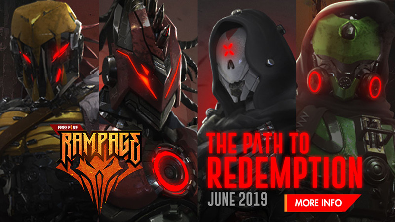
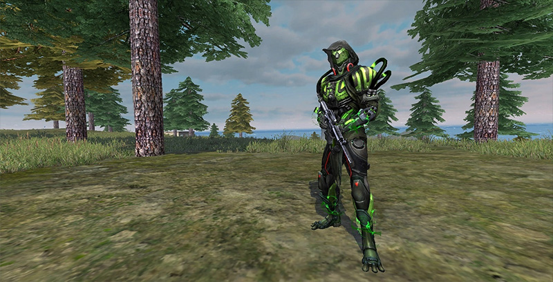
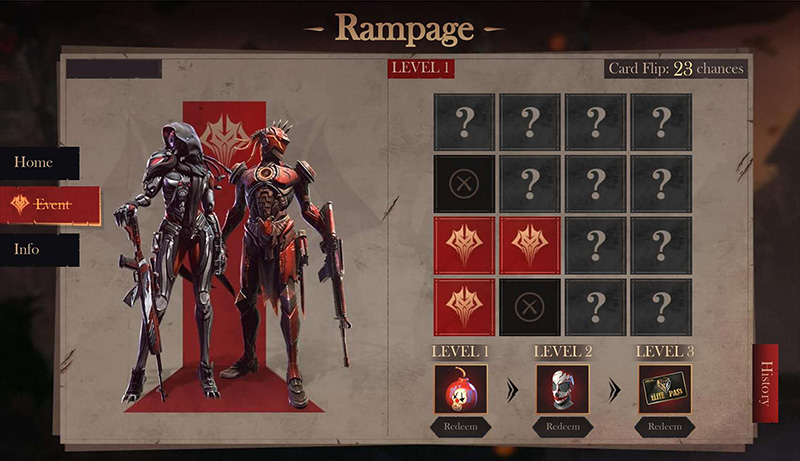
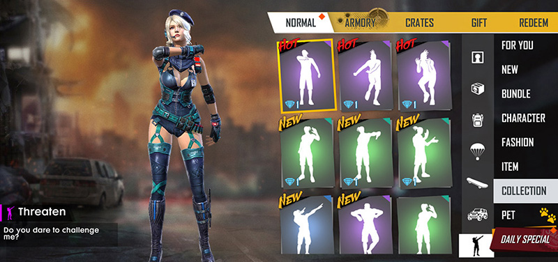
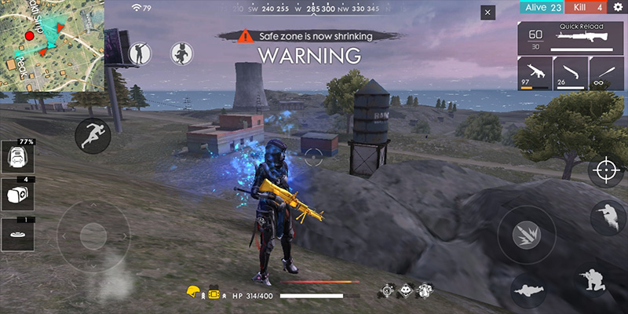
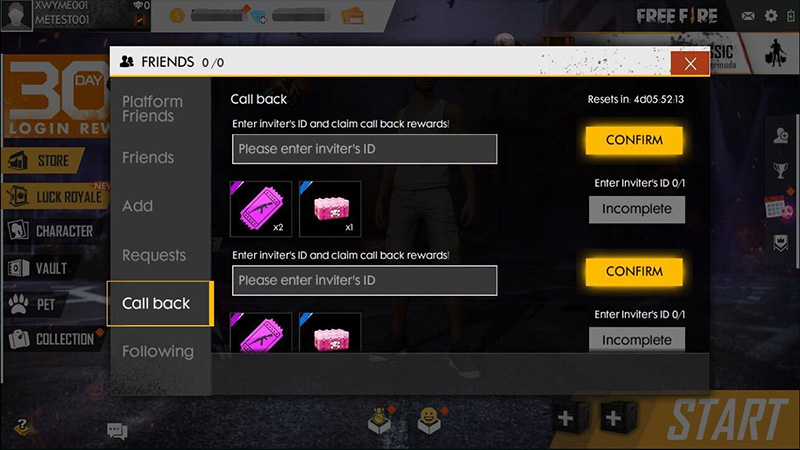
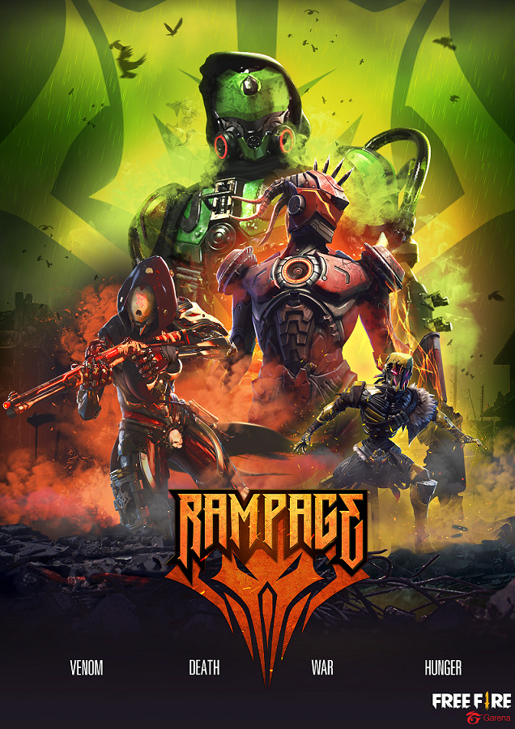

# Free Fire · 2019年Rampage活动补充

- 公告日期：2019-06-06
- 官方来源：[JOIN FREE FIRE RAMPAGE DAY](https://ff.garena.com/en/article/97/)
- 审阅日期：2026-09-19
- 2 个分类小节；2 项说明及表格行；7 张官方公告插图。

主流程通读正文并逐项复核；公告日期与活动日期分开，所有正文图归档展示。未在原文核实的OB号不推算。

公告日2019-06-06；各项实际状态及活动期限见小节。

Rampage主题总览（June 2019）。原文：JOIN FREE FIRE RAMPAGE DAY。[官方原图](https://cdn.wildflamestudio.com/common/web_event/official/200b58c51bab02.jpg) · 800×450。

Venom Touch服装展示。原文：JOIN FREE FIRE RAMPAGE DAY。[官方原图](https://cdn.wildflamestudio.com/common/web_event/official/6856e7f736c103.jpg) · 800×408。

Rampage网页抽奖界面。原文：JOIN FREE FIRE RAMPAGE DAY。[官方原图](https://cdn.wildflamestudio.com/common/web_event/official/00bc5d544f5e04.jpg) · 800×461。

Cut-Throat表情奖励展示。原文：JOIN FREE FIRE RAMPAGE DAY。[官方原图](https://cdn.wildflamestudio.com/common/web_event/official/234422ff2b6205.jpg) · 800×376。

Rampage局内画面。原文：JOIN FREE FIRE RAMPAGE DAY。[官方原图](https://cdn.wildflamestudio.com/common/web_event/official/b54d49224e2a06.jpg) · 800×400。

好友召回界面。原文：JOIN FREE FIRE RAMPAGE DAY。[官方原图](https://cdn.wildflamestudio.com/common/web_event/official/5847d022010e07.jpg) · 800×450。

Rampage四主题宣传图。原文：JOIN FREE FIRE RAMPAGE DAY。[官方原图](https://cdn.wildflamestudio.com/common/web_event/official/ec0bd9bc31ce08.jpg) · 636×899。

## BR · 大逃杀

## CS · 枪王对决

## 通用局内调整

### 死亡战利品箱代币

- 归属：通用局内调整 / 活动覆盖
- 原文小节：Collect tokens to gain Cut-Throat Emote
- 时间：2019-06-10～06-16。

- 6月10日至16日，每个死亡战利品箱内有一个Cute Skeleton Token。正文没有明确BR专属或所有模式适用。

### 射击巨型发光箱

- 归属：通用局内调整 / 活动覆盖
- 原文小节：Collect tokens to gain Cut-Throat Emote
- 时间：2019-06-15～06-16。

- 6月15日至16日，对局中随机出现巨型发光箱；向其射击可获得Killer Mask。未列点位、数量或破坏阈值。

## 其他玩法与局外内容（目录摘要）

### 代币兑换

6 Cute Skeleton Token换1 In-Game Bonus；每6 Killer Mask可换Red MP5、Gold M60或Venom Touch SPAS12 PVE枪箱；20代币换带特效Venom Touch滑板；30代币+15面具换Cut-Throat表情。

原文目录：Token exchange

### Rampage开放期

独立Rampage玩法6月15日至19日开放，每局后结算页掉落一个箱子；原文没有本模式战斗规则，不据此补造。

原文目录：New game mode: Rampage opening!

### 预注册和登录

6月10日至14日预注册、6月15日登录得Venom Touch称号和头像；6月15日登录另得该服装3日体验卡和Famine滑板。

原文目录：Pre-register and login

### 对局任务和网页奖励

6月15日至16日穿Venom Touch打3场Rampage得1钻石券+1武器券，任意模式6场得War和Death战利品箱；6月11日至18日登录及击杀获得Red Horse Skull Token，用于Rampage网页抽奖，标题提及EP激活卡。

原文目录：Wear Venom Touch / EP activation card

### 召回、排位保护与收益

召回超过7天未登录好友，奖励最高9999钻石。6月15日启用No Rank Drop；金币和碎片日上限翻倍，Solo的经验/金币/碎片翻倍，Duo与Squad三倍。

原文目录：Friend Callback / No Rank Drop / Increase the daily limit

## 官方图片索引

正文图片按相关小节展示，版本总览及其他章节插图另列；同一原图只嵌入一次。

- [Rampage主题总览（June 2019）](https://cdn.wildflamestudio.com/common/web_event/official/200b58c51bab02.jpg) · 800×450 · 本地 `assets/ff-patches/97-01.jpg`
- [Venom Touch服装展示](https://cdn.wildflamestudio.com/common/web_event/official/6856e7f736c103.jpg) · 800×408 · 本地 `assets/ff-patches/97-02.jpg`
- [Rampage网页抽奖界面](https://cdn.wildflamestudio.com/common/web_event/official/00bc5d544f5e04.jpg) · 800×461 · 本地 `assets/ff-patches/97-03.jpg`
- [Cut-Throat表情奖励展示](https://cdn.wildflamestudio.com/common/web_event/official/234422ff2b6205.jpg) · 800×376 · 本地 `assets/ff-patches/97-04.jpg`
- [Rampage局内画面](https://cdn.wildflamestudio.com/common/web_event/official/b54d49224e2a06.jpg) · 800×400 · 本地 `assets/ff-patches/97-05.jpg`
- [好友召回界面](https://cdn.wildflamestudio.com/common/web_event/official/5847d022010e07.jpg) · 800×450 · 本地 `assets/ff-patches/97-06.jpg`
- [Rampage四主题宣传图](https://cdn.wildflamestudio.com/common/web_event/official/ec0bd9bc31ce08.jpg) · 636×899 · 本地 `assets/ff-patches/97-07.jpg`

## 原文目录（对照用）

- JOIN FREE FIRE RAMPAGE DAY
